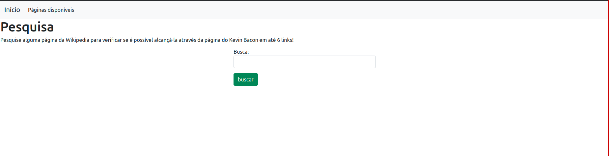
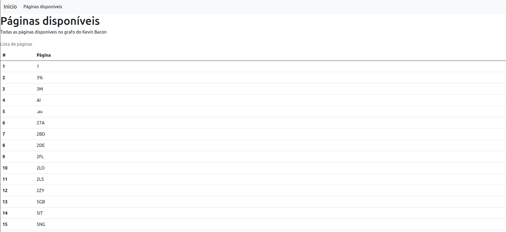
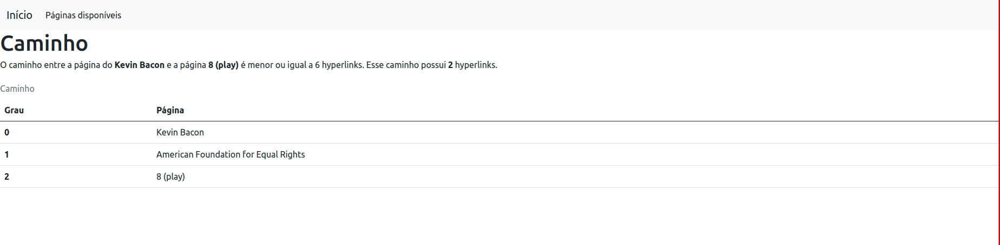

# Grafos1_Find_Bacon

**Número da Lista**: 2<br>
**Conteúdo da Disciplina**: Grafos 1<br>

## Alunos
|Matrícula   |               Aluno                  |
| ---------- | ------------------------------------ |
| 15/0132590 |      João Vitor Ramos de Souza       |
| 16/0046602 |  João Pedro de Aquino Corrêa Martins |

## Sobre 
O Find_Bacon tem o objetivo de verificar se a teoria do [Número de Kevin Bacon](https://en.wikipedia.org/wiki/Six_Degrees_of_Kevin_Bacon#Bacon_numbers) pode ser aplicada às páginas da Wikipedia (em inglês). No projeto foi utilizada a API da Wikipedia para se realizar as buscas das páginas e seus hyperlinks, criando assim um grafo para realização de buscas partindo da página do Kevin Bacon.

## Screenshots
1. Página inicial da aplicação
   
2. Páginas disponíveis
   
3. Caminho do grafo iniciando pela página do Kevin Bacon
   
## Instalação 
**Linguagem**: Python<br>
**Framework**: Django<br>

É necessário ter o Python (versão 3.8.x), Pip e docker-compose instalados em seu sistema operacional.

Instale as dependências do Python no seu sistema operacional com o seguinte comando:
```sh
$ git clone https://github.com/projeto-de-algoritmos/Grafos1_Find_Bacon
$ cd Grafos1_Find_Bacon
$ pip3 install -r requirements.txt
```

Também é necessário ter um banco de dados Postgres sendo executado e para isso foi adicionado o docker-compose para se facilitar a criação do ambiente. Com o docker-compose instalado, basta executar o seguinte comando:

```sh
$ docker-compose up
```

**Importante:** O comando `docker-compose up` irá inutilizar o terminal aberto, para se subir o container do banco de dados em bacground, basta executar o comando `docker-compose up -d`

Para facilitar a primeira execução do projeto, foi adicionado o arquivo `dump.zip` com um arquivo `json` para carregar o dump de um grafo com 25 hyperlinks por página. Extraia o arquivo `dump.zip` e execute os seguintes comandos para carregar o grafo no banco de dados. Na seção "Outros" existe outra forma de carregar um grafo sem a necessidade de extrair um arquivo `.zip`
Carregando dados:
```sh
$ cd find_kevin_bacon
$ unzip dump.zip # Comando para extrair arquivos .zip em ambientes linux
$ python manage.py loaddata kevin_bacon_graph_dump.json
```

Realize as migrações do banco de dados com o seguinte comando:
```sh
$ cd find_kevin_bacon
$ python manage.py migrate
```

Suba o servidor Django com o comando abaixo:
```sh
$ cd find_kevin_bacon
$ python manage.py runserver
```

## Uso 

1. Com todos os comandos de instalação já executados, abra seu navegador em `http://localhost:8000`
2. Para visualizar as páginas disponíveis para busca, clique na navbar em **Páginas disponíveis** ou acesse a url `http://localhost:8000/graph-pages/`
3. Para realizar a busca de uma página, clique em **Início** ou volte para a url `http://localhost:8000` e insira a página de busca desejada. Após isso, clique em buscar.
4. Com isso, deverá ser exibido o caminho do grafo partindo da página do Kevin Bacon


## Outros 
Caso não queira utilizar um grafo pré-montado, existe um comando disponível para a criação dele no código. Para executá-la é necessário rodar o comando:
```sh
$ cd find_kevin_bacon
$ python manage.py build_graph ---qty-links=<quantidade de links por página>
```


